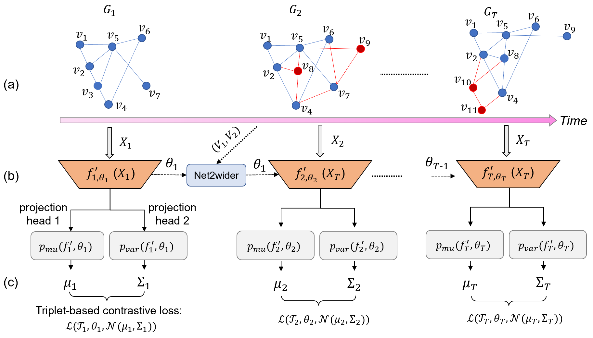

# DynG2G: An Efficient Stochastic Graph Embedding Method for Temporal Graphs

This repository contains the code for [*DynG2G: An Efficient Stochastic Graph Embedding Method for Temporal Graphs*](https://arxiv.org/abs/2109.13441) by *Mengjia Xu, Apoorva Vikram Singh and George Em Karniadakis*; This work has been submitted to [*IEEE Transactions on Neural Networks and Learning Systems*](https://cis.ieee.org/publications/t-neural-networks-and-learning-systems) in 2021.



## Setting up the Environment to run the code


To create an environment to run the code, execute the shell file on the terminal using:

```setup
sh ./env_create.sh
```

The new environment called DynG2G is created. It will include all the dependencies needed to run the code. Activate it using:

```activate
source activate DynG2G
```

## Downloading the data to run the code

To download all datasets used in the experiment, run the shell file:

```download
sh ./download_data.sh
```


To download the datasets seperately:

- AS dataset: [Download link](http://snap.stanford.edu/data/as-733.html)
- SBM dataset: [Download link](https://github.com/IBM/EvolveGCN/blob/master/data/sbm_50t_1000n_adj.csv.tar.gz)
- Bitcoin-OTC dataset: [Download link](http://snap.stanford.edu/data/soc-sign-bitcoin-otc.html)
- UCI dataset: [Download link](http://konect.cc/networks/opsahl-ucsocial/)
- Slashdot: [Download link]()
- Facebook: [Download link]()
- Reality Mining: [Download link]()
- Digg: [Download link]()

## Generating the embeddings

To generate the embeddings for AS dataset, run the command:

```train
python Generate_Embeddings/AS_embed.py -f configs/[configFile]
```

Similarily, the embeddings for other datasets can be generated by running their corresponding files in Generate_Embeddings folder along with the desired configuration files (config).

- ***You can simply skip this process and download the embeddings from [here](https://www.dropbox.com/s/nxrfjkwz5nczyrt/results.zip?dl=0).***

## Evaluating the embeddings

To evaluate the embeddings for AS dataset run this command:

```eval
python Evaluation/eval-as.py -f configs/[configFile]
```
Similarily, we can evaluate the embeddings for other dataset by running their corresponding files in the Evaluation folder.

## Plotting the Graph

To plot the graphs for MAP and MRR, run the command:

```plot
python graph.py -f configs/[configFile] -d [datasetName]
```
datasetName = as/sbm/otc/uci

This will generate the plot for MAP and MRR for the corresponding dataset.

## Reference
If you find this code useful in your research, please cite:
```
@article{xu2021dyng2g,
  title={DynG2G: An Efficient Stochastic Graph Embedding Method for Temporal Graphs},
  author={Xu, Mengjia and Singh, Apoorva Vikram and Karniadakis, George Em},
  journal={arXiv preprint arXiv:2109.13441},
  year={2021}
  url={https://arxiv.org/pdf/2109.13441.pdf}
}
```


